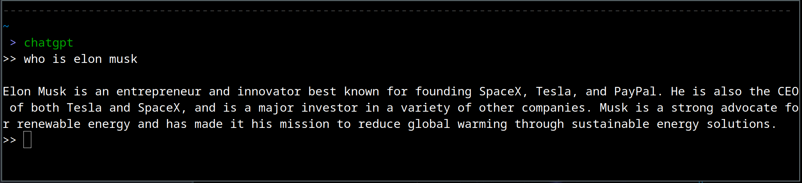

chatgpt: Chat GPT console client in Golang
======================

 

A Golang console client for ChatGPI (<https://chat.openai.com>) using GPT

Install
--------------

    go install -x github.com/rostislaved/chatgpt@latest

Request for API from OpenAI
---------------------

1. Request your OpenAPI key in [https://beta.openai.com/account/api-keys](https://beta.openai.com/account/api-keys)
2. export API_KEY=OpenAPI_key
3. go install -x github.com/rostislaved/chatgpt@latest

Usage
---------------------

1. In terminal: chatgpt
2. Enter your prompt

Snapshot
---------------

License
---------------

This package is licensed under MIT license. See LICENSE for details.
